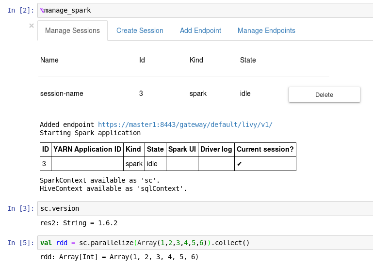

## Configure a new service for Knox


### Service definition

```bash
$ sudo mkdir -p /usr/hdp/current/knox-server/data/services/livy/0.1.0/
$ sudo chown -R knox:knox /usr/hdp/current/knox-server/data/services/livy 
```

- Create a service definition file

	```bash
	$ cat /usr/hdp/current/knox-server/data/services/livy/0.1.0/service.xml
	```

	```xml
	<service role="LIVYSERVER" name="livy" version="0.1.0">
	  <routes>
	    <route path="/livy/**"/>
	  </routes>
	</service>
	```


- Create a rewrite rule file

	```bash
	$ cat /usr/hdp/current/knox-server/data/services/livy/0.1.0/rewrite.xml
	```

	```xml
	<rules>
	  <rule dir="IN" name="LIVYSERVER/livy/inbound" pattern="*://*:*/**/livy/v1/?{**}">
	    <rewrite template="{$serviceUrl[LIVYSERVER]}"/>
	  </rule>
	  <rule dir="IN" name="LIVYSERVER/livy/inbound" pattern="*://*:*/**/livy/v1/{path=**}?{**}">
	    <rewrite template="{$serviceUrl[LIVYSERVER]}/{path=**}?{**}"/>
	  </rule>
	</rules>
	```


- Publish new Path via Ambari: Goto Knox Configuration and add at the end of *Advanced Topology*:

	```xml
		<topology>

		...

	        <service>
	            <role>LIVYSERVER</role>
	            <url>http://master1.localdomain:8998</url>
	        </service>
		</topology>
	```

## Start LDAP (optional)

If Knox is not configured with an LDAP server already, start Knox's test LDAP server

```bash
$  /usr/hdp/current/knox-server/bin/ldap.sh start
```

A test user is `guest`with password `uest-password`


## Configure Sparkmagic

If Knox does not have a valid certificate for HTTPS requests, reconfigure [config.json](config.json) end set

'''json
 "ignore_ssl_errors": false
'''

Then restart Jupyter and open a Spark Notebook.

Again `%load_ext sparkmagic.magics` and `%manage_spark` and now add the Knox Gateqway address and a valid user (Knox will authenticate this user)


The next steps are the same as without Knox:




